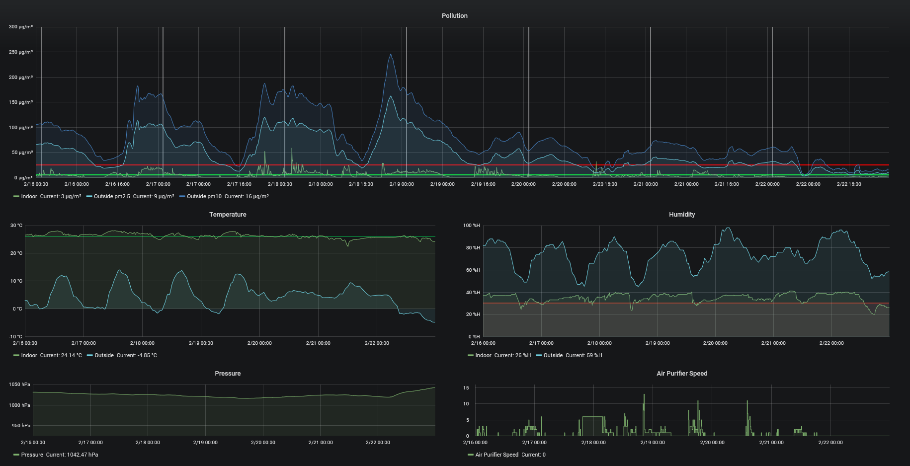

# Xiaomi Air Purifier 2S Driver
An improved driver for Xiaomi Air Purifier 2S automation.

# Features:
- Day/Night mode
- Cooling mode
- Low humidity protection
- Database logger
- Airly logger

# Requirements
- Postgres SQL Server
- Node.js
- Yarn

# Install
```
yarn install
npm install
```

# Configuration
Go to `app.js` and set necessary flags:
```
const airPurifierIP = 'AIR PURIFIER IP ADDRESS';
```
If You want to use Airly measurements:
```
const airlyApiKey = "AIRLY API KEY";
const latitude = "LATITUDE";
const longitude = "LONGITUDE";
```
Or disable it by setting:
```
const enableAirly = false;
```
Setup database connection `db.js`. All necessary fields will be created automaticaly.
```
const host = "localhost";
const port = "5432";
const databaseName = "home";
const login = "postgres";
const password = "";
```
If You won't be using database, remove this import in `app.js` and set logging flag to false:
```
import * as db from './db.js';
```
```
const databaseLogging = false;
```

# Running the driver
Start your database server, then application:
```
nodejs index.js
```

# Example logged data
I highly recommend using grafana to create graphs.


## Credits
* [bartekn](https://github.com/bartekn) for initial idea.
* [aholstenson](https://github.com/aholstenson) for miio library.