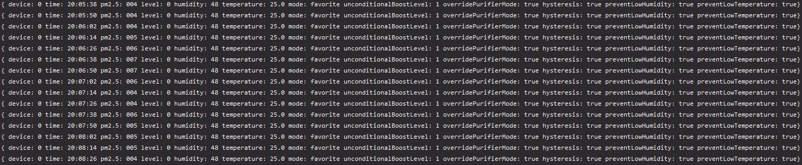

# Xiaomi Air Purifier 2/2S Driver
An improved driver for Xiaomi Air Purifier 2/2S automation.

# Features:
- Multi-device support
- Hysteresis
- Force turn on / favourite mode
- Display settings
- Day/Night mode
- Day/Night cooling
- Unconditional speed boost
- Low/Critical humidity warning
- High temperature warning
- Low temperature protection
- Highly customisable speed
- Database logger
- Airly logger

## Hysteresis
One of the best features of this script is the built-in implementation of [hysteresis](https://en.wikipedia.org/wiki/Hysteresis). This allows for preventing unwanted frequent speed changes. 
The standard version only helps with +/- 1 level differences. This one is highly recommended for everybody to reduce speed and possible Air Purifier wear due to constant jumping between speed levels.
There is also a more advanced/conservative version, which is turned on by default as well. This one prevents big speed jumps, when there is a possibility, that they are unwanted.

#### Examples
- When going from level 1 to 14, there will be created an additional step at level 8, to check if the pollution around purifier is still rising, to make sure it’s not a false alarm.
- When the device was running at a high level for a while, and this will be followed by a sudden drop in pollution. The speed of the purifier will at first drop in half, to make sure it’s not a false alarm.

## Multi-device support
Go to `devices.json` and add devices duplicating first entry, like this:
```
  {
    "name": "",
    "ip": "192.168.0.222",
    "token": "123",
    "minSpeed": 0,
    "maxSpeed": 14,
    "hysteresisStack": [],
    "debug": {}
  },
  {
    "name": "",
    "ip": "192.168.0.223",
    "token": "456",
    "minSpeed": 0,
    "maxSpeed": 14,
    "hysteresisStack": [],
    "debug": {}
  }
```
#### Remember: 
- Separate devices on a list with a comma, like in the example
- Only first device on the list will be logging to database

## Unconditional speed boost
If you feel that the device is temporary running too slow at all pm2.5 levels, you can enable this feature at any time, and set the preferred boost level.
```
unconditionalBoost: false
unconditionalBoostLevel: 0
```

## Low-temperature protection
When the temperature in the room drops below a certain value, you may want to set it on the slowest possible speed.
This might be helpful when the device is standing very close to you, and the sensed room temperature in combination with a breeze from the purifier fan is becoming unpleasant.
```
preventLowTemperature: false
preventLowTemperatureThreshold: 24.8
preventLowTemperatureSpeed: 0
```

## Cooling down and high-temperature warning
When the sensed temperature in the room is too high, you can use your device to improve air circulation and create some pleasant breeze. 
`dayCoolingDownThreshold` is the temperature at which the purifier will start ramping up the speed. At every `dayTempBetweenLevels` speed will be increased by 1 level.
When the speed will rise by `preventHighTemperatureMultiplier` levels, the purifier will start beeping reminding you to take other possible steps.

This can be set separately for day and night with different settings.
```
"dayEnableCoolingDown": true
"dayCoolingDownThreshold": 26.5
"dayTempBetweenLevels": 0.6
"preventHighTemperature": true
"preventHighTemperatureMultiplier": 5
```

```
"nightEnableCoolingDown": true
"nightCoolingDownThreshold": 27.0
"nightTempBetweenLevels": 0.4
```

## Low/Critical humidity warning
Carbon purifier filters tend to accumulate some moisture and decrease room humidity. 
This setting will allow sacrificing air quality to save some moisture at extremely low levels.
At `lowHumidityThreshold` purifier will slow down by 1 level, and below criticalHumidityThreshold, the device will stay on level 0.
```
"preventLowHumidity": true
"lowHumidityThreshold": 30
"criticalHumidityThreshold": 28
```
## Day / night mode
AirPurifierDriver allows you to set different speeds at certain pollution level separately for day and night.
With night mode is turned on, purifier display will be turned off, until pollution level is below `criticalPM25Display`.
Relevant variables:
```
"enableNightMode": true
"disableLedAtNight": true
"criticalPM25Display": 25
```

# Requirements
- Postgres SQL Server
- Node.js 13.1+

# Install
```
git clone -b master https://github.com/LukaszLapaj/AirPurifierDriver.git
npm install
```

# Configuration
Go to `devices.json` and set necessary information:
```
"ip": "AIR PURIFIER IP ADDRESS";
```
Go to `config.json` and set necessary information:
If You want to use Airly measurements:
```
"airlyApiKey": "AIRLY API KEY";
"latitude": "LATITUDE";
"longitude": "LONGITUDE";
```
Or disable it by setting:
```
"enableAirly": false;
```
Go to `db.mjs` and set up database connection. All the necessary fields in database will be created automatically.
```
const host = "localhost";
const port = "5432";
const databaseName = "home";
const login = "postgres";
const password = "";
```
If You won't be using database, remove this import in `app.mjs` and set logging flag to false:
```
import * as db from './db.mjs';
```
```
"databaseLogging": false
```

# Running the driver
Start your database server, then application:
```
npm run start
```

# Example output


# Example logged data presentation
I highly recommend using grafana to create graphs.


## Credits
* [bartekn](https://github.com/bartekn) for initial idea.
* [aholstenson](https://github.com/aholstenson) for miio library.